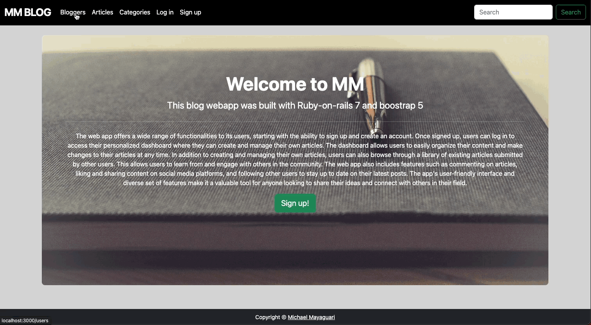
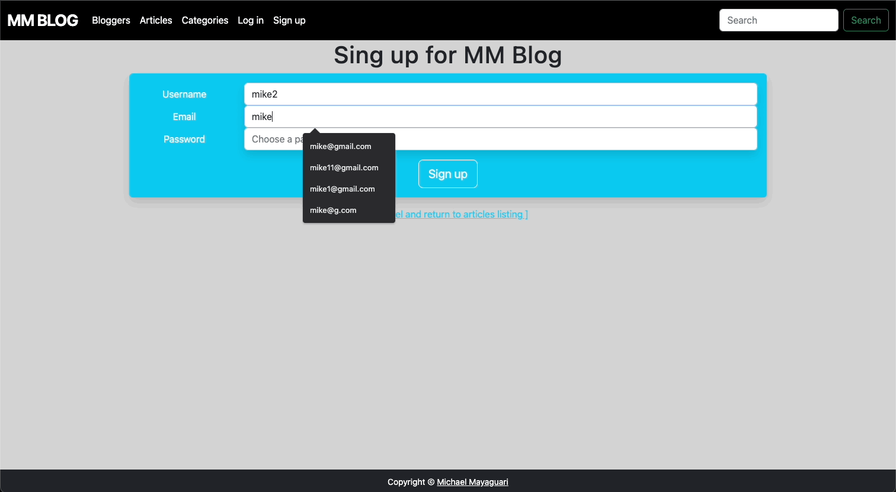
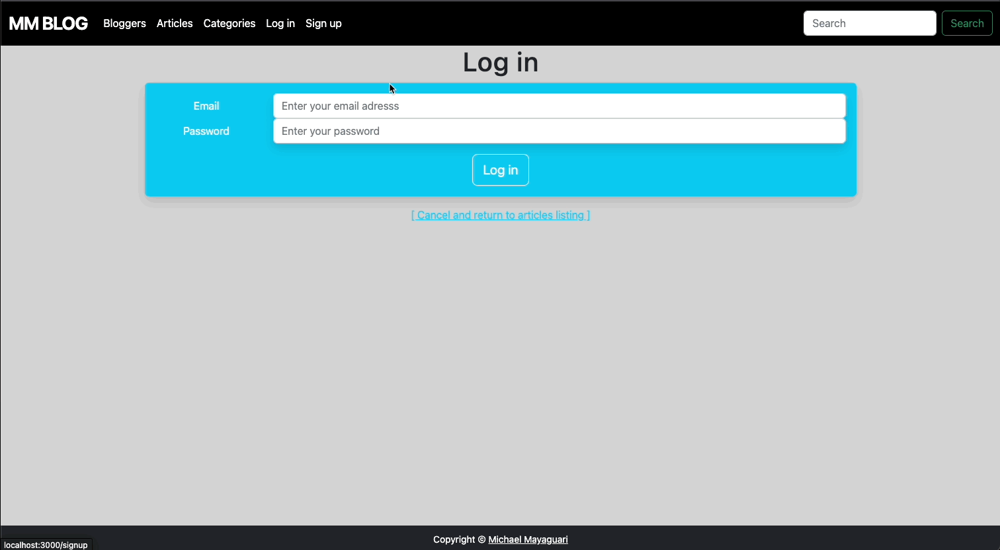

# MM WebApp

### Description

This web app is built using the latest version of Rails (Rails 7) and the popular front-end framework Bootstrap 5. The app is designed to be fast, responsive, and user-friendly, with a sleek and modern interface. It offers a wide range of features and functionalities, from user authentication and authorization to data management and dynamic content. With its powerful combination of Rails and Bootstrap, this web app is the perfect choice for developers who want to build robust and visually appealing applications in a short amount of time.

### Dependecies

* Ruby version: 3.0.0
* Rails version: 7.0.4.2
* Bootstrap version: 5.2.3

### Functionalities

* Signup flow: The web app allows users to create a new account by providing their name, email, and password. Upon successful signup, the user is directed to the login page.

* Login flow: Users can log in to the web app by entering their email and password. If the credentials are correct, the user is directed to their dashboard.

* Dashboard: Once logged in, users can view their dashboard, which displays all of their articles, including published and draft articles. The dashboard also includes an option to create a new article.

* Create Article: Users can create a new article by selecting a category, providing a title, and entering the article content.

* Edit Article: Users can edit an existing article by selecting it from their dashboard and clicking the edit button. They can make changes to the title, content, and category.

* Delete Article: Users can delete an existing article by selecting it from their dashboard and clicking the delete button. A confirmation message will be displayed before the article is permanently deleted.

* Categories: The web app includes a category system that allows users to categorize their articles. The categories can be created, edited, or deleted by the admin.

* Admin Features: The web app includes admin features that allow the admin to manage the categories, view all articles, and approve or reject articles submitted by users. The admin can also delete user accounts if necessary.

Overall, this web app provides a user-friendly platform for creating and managing articles, while also allowing for easy categorization and administration by the site owner.

### Steps necessary to get the application up and running locally

> Make sure you have Ruby and Rails installed on your local machine. You can check this by running `ruby -v` and `rails -v` in your terminal.

1. Clone this repository

2. Navigate to the app's directory in your terminal using the cd command

3. Run `bundle install` to install all the app's dependencies

4. Create the app's database by running `rails db:create` in your terminal

5. Migrate the database schema by running rails `db:migrate` in your terminal

6. Start the Rails server by running `rails server` or `rails s` in your terminal

7. Open your web browser and navigate to `http://localhost:3000`, where you should see the app's home page.

### Demo

#### Public blog page

#### Sign up flow

#### Login flow

#### Login as admin

